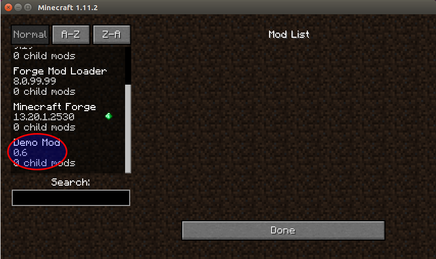
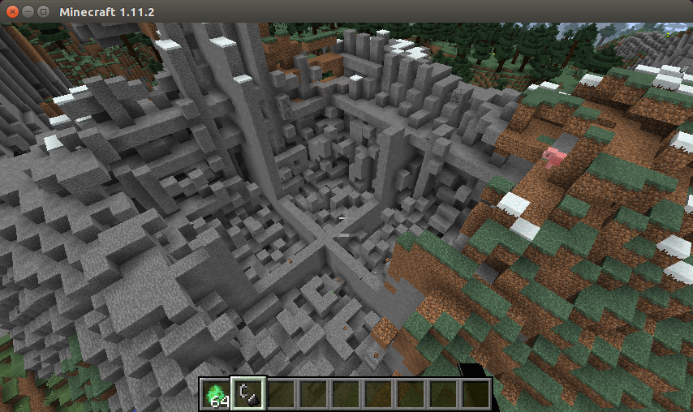

Your first mod
==============

In this section we will develop a very simple mod, just to introduce how the whole process work.

If you followed the setup process, you already have a running environment, with an empty sample mod. Lets understand and
evolve this mod a bit. This the current code you get with the template for _EasyForger 0.6_ (omitting imports):

```scala
@Mod(modid = EFExampleMod.modId, name = "EF Example Mod", version = "0.6", modLanguage = "scala")
object EFExampleMod extends EasyForger {
  final val modId = "ef-example-mod"

  @EventHandler
  def init(event: FMLInitializationEvent): Unit = {
    println("EF Example Mod is running!")
  }
}
```

It is important to notice that the only thing that is specific to _EasyForger_ is the `extends EasyForger` part. Everything
else is standard _Minecraft Forge_ setup.

We start with the `@Mod` annotation, where we set some minimal information about our mod. One of the settings we enable here
is the `modLanguage`, where we let _Minecraft Forge` know that we will be using hte _scala language_.

Lets change our mod name, just to see how it affects the running environment. In the new version of the annotation below, we
change both the _mod name_ and the _mod id_:

```scala
@Mod(modid = DemoMod.modId, name = "Demo Mod", version = "0.6", modLanguage = "scala")
object DemoMod extends EasyForger {
  final val modId = "demo-mod"

  @EventHandler
  def init(event: FMLInitializationEvent): Unit = {
    println("Demo Mod is running!")
  }
}
```
We also took the opportunity to change the _scala object_ name. Also remember that the annotated element has to be a
`scala object`, not a `class` nor `trait`.

If we execute `runClient` now, the result, in the mods list inside the game, should look similar to the following:



Lets know do a very small modification to the game: lets make the _Creeper_ explosion way bigger than normal. Add the following
code to the _init_ method in our mod:

```scala
  @EventHandler
  def init(event: FMLInitializationEvent): Unit = {
    println("Demo Mod is running!")

    creatures( this,
      creeper(
        explosionRadius = 100
      )
    )
  }
```

And that is all. You can run the game again, look for the new creeper added by _EasyForger_ and explode it. The resulting
damage will be similar to the following:


