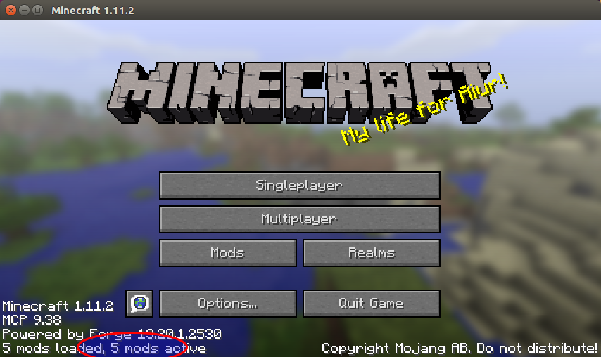
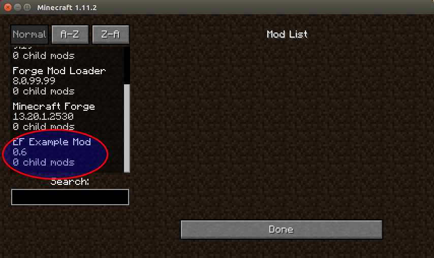
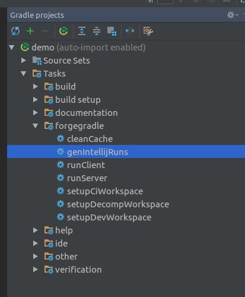
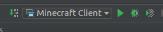

Setting up your Environment
===========================

If you already kow how to setup a Minecraft Forge environment, you will notice that the steps below are very
similar. The main difference is that we have an additional library, _easyforger-core_.

We will start by downloading the [mod template](https://github.com/easyforger/ef-mod-template/archive/0.6-1.11.2.tar.gz).
So go ahead and download it. This template is set specifically for _EasyForger 0.6_ and _Minecraft 1.11.2_. You can find
[all available template versions here](https://github.com/easyforger/ef-mod-template/releases).

If you are using Linux, the following command will do that downloading for you:

```bash
cd /tmp
wget https://github.com/easyforger/ef-mod-template/archive/0.6-1.11.2.tar.gz
tar zxvf 0.6-1.11.2.tar.gz
```

Here we are downloading and unpacking the template in the `/tmp` folder because it will be discarded when we are done.
You should choose a folder that makes sense for your case. Finally, you will problably want to rename the mod folder to
something nicer. Here we will simply call it _demo_. I know, very creative :)

```bash
mv ef-mod-template-0.6-1.11.2 demo
```

Now we are ready to start really setting the development environment. For that, getting into the mod folder and run the
setup command. as follows:

```bash
cd demo
./gradlew setupDecompWorkspace
```

Here we have one more secret revealed to us: we use _gradle_ as the build tool when we are developing Minecraft Mods. The
reason for that is quite simply: it is what _Minecraft Forge_ uses, and it includes a significant amount of custom tasks that
make using other tools not feasible. On top of that, gradle is a nice tool.

If this is the first time you setup a _Minecraft Forge_ mod environment on your machine, the previous command will take a
while to complete. This is normal, so please be patient here.

At this point, we can already check if the setup is working. For that, launch _Minecraft_ from our environment with the
following command:

```bash
./gradlew runClient
```

The result of this command will a Minecraft instance running, with one mod installed: the empty mod that comes with the
template. Something similar to the screenshot below:



Now, we said _one_ mods, but the screen tells us that there are five. This is because _Minecraft Forge_ itself includes
four basic mods. We can double check that by clicking in the _Mods_ button at the start screen. The new screen that will
appear will be similar to the following:



If you got to this point, the basic setup is done. There is at least one extra thing you should do though, which we will
cover below.

IntelliJ IDEA
-------------

The recommended tool for developing mods with _EasyForger_ is _IntelliJ IDEA_, due to its good _gradle_ and _scala_ support.
So lets setup our demo mod to be executable from within IDEA.

_Note:_ We assume you have IDEA's Scala plugin installed. If not, please install it before continuing.

The first thing you have to do is to import the project inside IDEA. For that, launch IDEA and click the _Open ..._ option
to open a new project. Find your mod folder and click ok. The folder icon will be the _gradle logo_, because _IDEA_ will
recognize the mod as a _gradle_ project.

When prompted with the import options, we recomend marking the _Use auto-import_ option, so that you don't have to keep
remembering to refresh the project each time you change _build.gradle_ - even though you won't be doing this too often.
Then click ok again.

Like with the _setupDecompWorkspace_ that we did before, if this is the first time you import a _Minecraft Forge_ into IDEA,
this will take a while. Please be patient again.

When the import is done, there is one last step: we need to tell _IDEA_ how to launch a new _modded Minecraft_ instance. To
do that, you have to run the `genIntellijruns` gradle task. You can do that via the command line, or directly from inside
_IDEA_, like in the image below:



After this is done, you will be able to select the _Minecraft Client_ option from _IDEA_'s run configurations and start a
modded minecraft instance, exactly like with did before with the `./gradlew runClient` command.



Next: it is time to develop [your first mod](first-mod.md)!
